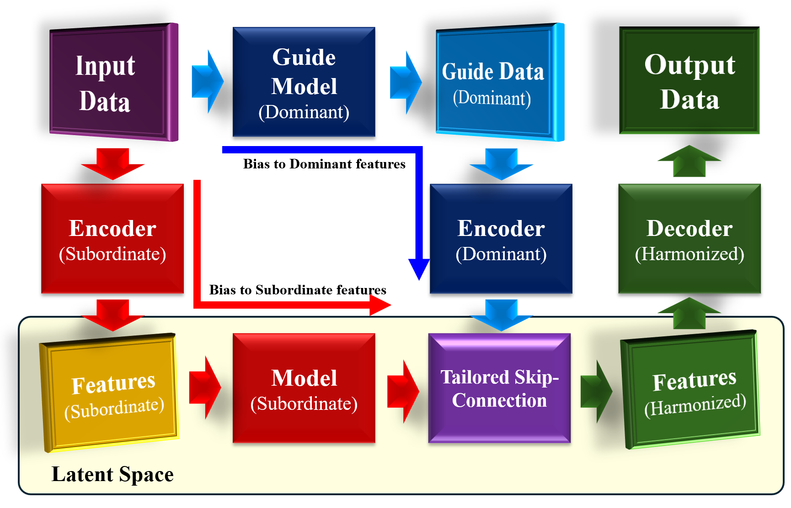
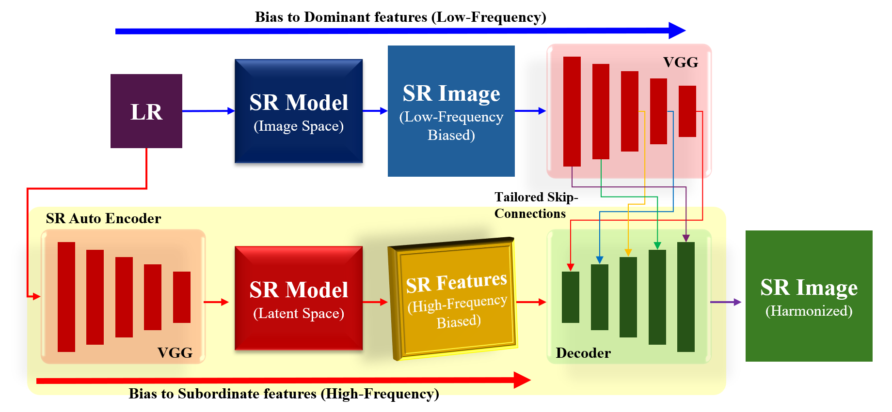
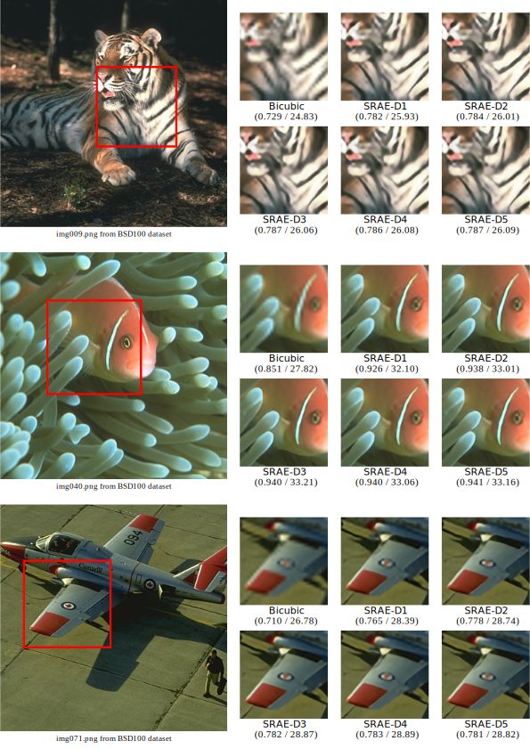

# **A New Tailored Skip Connection (TSC) for Auto Encoders**


---
## **Notice**
This paper is currently under review for publication in IEEE Access.

---

## 📚 **Overview**
This repository introduces **Tailored Skip Connection (TSC)**, a novel mechanism for **auto encoders** that enhances subordinate feature learning by attenuating dominant features in the latent space. TSC enables a tailored integration of dominant features through skip connections, harmonizing them with subordinate features computed in the auto encoder.

To validate the effectiveness of TSC, we applied it to Super-Resolution (SR) tasks as a case study. While our primary focus is demonstrating TSC's structural benefits, our method achieves improved **SSIM** and **LPIPS** scores when combining guide models with subordinate feature learning.

---

## ✨ **Features**
- Designed for **auto encoders**, applicable across various deep learning tasks.
- Efficient fusion of **dominant** and **subordinate features** using tailored skip connections.
- Validation through SR tasks, demonstrating enhanced SSIM and LPIPS scores.

---

## 📂 **Dataset**
We provide both the original datasets and our modified versions:

- 🔗 **Modified Datasets**: [Download via Google Drive](https://drive.google.com/drive/folders/109HkUblxFp99bTFVWqcKB5y4_-Okakup?usp=drive_link)

### Original Dataset Sources:
- **BSD100**: [Berkeley Segmentation Dataset](https://www2.eecs.berkeley.edu/Research/Projects/CS/vision/bsds/)
- **Urban100**: [Download and Citation](https://github.com/jbhuang0604/SelfExSR)
- **Set5 & Set14**: [Compiled Versions](https://github.com/LimBee/NTIRE2017)

Please ensure to adhere to the terms of use for each dataset.

---

## 🛠️ **Installation**
The repository is structured for ease of use in **Google Colab**. All operations (training, testing, data loading) can be controlled through the **`TSC_master.inpyb`** file.

1. Clone the repository:
   ```bash
   git clone https://github.com/Juicy-Honey/TSC-AutoEncoder.git
   cd TSC-AutoEncoder/SRAE
   ```

2. Open **`TSC_master.inpyb`** in Google Colab or a Jupyter Notebook environment.

3. Run the necessary cells to execute training or testing. Supporting Python scripts are located in the `SRAE/functions` directory and are automatically integrated with `TSC_master.inpyb`.

---

## 🚀 **Usage**
### Training
Training procedures are outlined in **Section 2. Train** within `TSC_master.inpyb`. Update the configurations and run the relevant cells to begin training.

### Testing
Testing procedures are detailed in **Section 3. Test** within `TSC_master.inpyb`. Simply load the pre-trained weights and execute the cells to generate outputs.

---

## 📊 **Results**
The effectiveness of TSC was validated using SR tasks. While the PSNR scores are slightly lower due to bicubic fusion, the SSIM scores are consistently higher, emphasizing improved perceptual quality.


| Dataset     | Bicubic        | SRCNN [7]       | **SRAE-D2 (Ours)** | EDSR [38]       | SRResNet [39]  | RCAN [40]      | DRCT-L [41]    | SwinIR [42]    |
|-------------|----------------|-----------------|---------------------|-----------------|----------------|----------------|----------------|----------------|
| **Set5**    | 0.806 / 27.10  | 0.862 / 30.49  | **0.880** / 29.92      | 0.896 / 32.46  | -              | -              | -              | -              |
| **Set14**   | 0.699 / 24.51  | 0.751 / 27.50  | **0.769** / 26.46      | 0.787 / 28.80  | 0.818 / 28.49  | 0.788 / 28.87  | 0.802 / 29.54  | 0.795 / 29.15  |
| **BSD100**  | 0.665 / 24.65  | 0.710 / 26.90  | **0.729** / 25.96      | 0.742 / 27.71  | 0.762 / 27.58  | 0.743 / 27.77  | 0.757 / 28.16  | -              |
| **Urban100**| 0.655 / 21.80  | 0.722 / 24.52  | **0.757** / 23.90      | 0.803 / 26.64  | -              | 0.802 / 26.62  | 0.850 / 28.70  | 0.797 / 26.43  |

> **Note**: The results highlight TSC’s ability to enhance SSIM, emphasizing perceptual quality over pixel accuracy.
>
> 
> 

---

## 📧 **Contact**
For inquiries, feel free to reach out:

- **Email**: [desirejsy26@gmail.com](mailto:desirejsy26@gmail.com)
- **GitHub**: [Juicy-Honey](https://github.com/Juicy-Honey)

---
